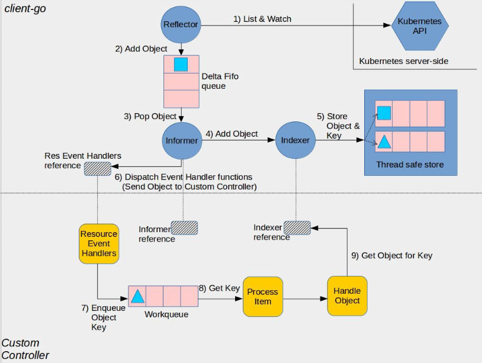
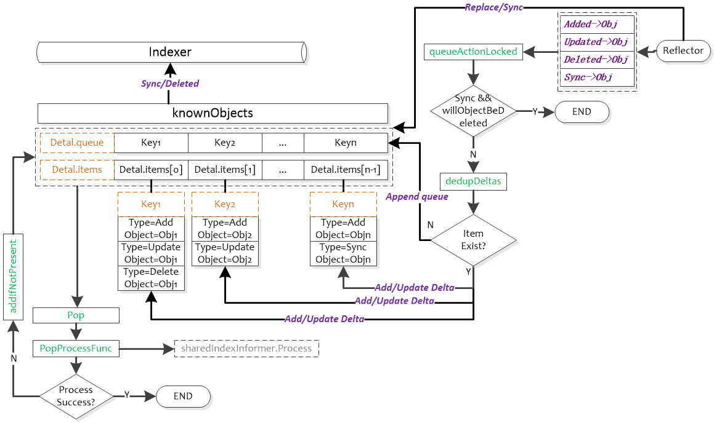

DeltaFIFO也包含在 Informer 中。DeltaFIFO 是 Delta + FIFO（先进先出队列），Delta的数据格式如下。DeltaType是String的类型，只有四种，分别是增加，更新，删除，同步。作为FIFO，有push和pop方法。

```go
type Delta struct {
	Type   DeltaType
	Object interface{}
}
```

```go
const (
    Added   DeltaType = "Added"  // 增加
    Updated DeltaType = "Updated"  // 更新
    Deleted DeltaType = "Deleted"  // 删除
    Sync DeltaType = "Sync"  // 同步
)
```

DeltaFIFO 是一个可用于处理Kubernetes资源对象更改的队列。 从下图看出，DeltaFIFO 是一个生产者-消费者的队列，生产者是 Reflector，消费者是 Pop 函数。消费的数据一方面存储到 Indexer 中，另一方面可以通过 Informer 的 handler 进行处理，Informer 的 handler 处理的数据需要与存储在 Indexer 中的数据匹配。需要注意的是，Pop 的单位是一个 Deltas，而不是 Delta。

DetlaFIFO 同时实现了 Queue 和 Store 接口，使用 Deltas 保存了对象状态的变更（Add/Delete/Update）信息，Deltas 缓存了针对相同对象的多个状态变更信息，如 Pod 的 Deltas[0]可能更新了标签，Deltas[1]可能删除了该 Pod。最老的状态变更信息为 Oldest()，最新的状态变更信息为 Newest()，使用中，获取 DeltaFIFO 中对象的 key 以及获取 DeltaFIFO 都以最新状态为准。



```go
type Queue interface {
	Store

	// Pop blocks until there is at least one key to process or the
	// Queue is closed.  In the latter case Pop returns with an error.
	// In the former case Pop atomically picks one key to process,
	// removes that (key, accumulator) association from the Store, and
	// processes the accumulator.  Pop returns the accumulator that
	// was processed and the result of processing.  The PopProcessFunc
	// may return an ErrRequeue{inner} and in this case Pop will (a)
	// return that (key, accumulator) association to the Queue as part
	// of the atomic processing and (b) return the inner error from
	// Pop.
	Pop(PopProcessFunc) (interface{}, error)

	// AddIfNotPresent puts the given accumulator into the Queue (in
	// association with the accumulator's key) if and only if that key
	// is not already associated with a non-empty accumulator.
	AddIfNotPresent(interface{}) error

	// HasSynced returns true if the first batch of keys have all been
	// popped.  The first batch of keys are those of the first Replace
	// operation if that happened before any Add, AddIfNotPresent,
	// Update, or Delete; otherwise the first batch is empty.
	HasSynced() bool

	// Close the queue
	Close()
}
```

```go
type Store interface {

	// Add adds the given object to the accumulator associated with the given object's key
	Add(obj interface{}) error

	// Update updates the given object in the accumulator associated with the given object's key
	Update(obj interface{}) error

	// Delete deletes the given object from the accumulator associated with the given object's key
	Delete(obj interface{}) error

	// List returns a list of all the currently non-empty accumulators
	List() []interface{}

	// ListKeys returns a list of all the keys currently associated with non-empty accumulators
	ListKeys() []string

	// Get returns the accumulator associated with the given object's key
	Get(obj interface{}) (item interface{}, exists bool, err error)

	// GetByKey returns the accumulator associated with the given key
	GetByKey(key string) (item interface{}, exists bool, err error)

	// Replace will delete the contents of the store, using instead the
	// given list. Store takes ownership of the list, you should not reference
	// it after calling this function.
	Replace([]interface{}, string) error

	// Resync is meaningless in the terms appearing here but has
	// meaning in some implementations that have non-trivial
	// additional behavior (e.g., DeltaFIFO).
	Resync() error
}
```

```go
// 获取Deltas newest delta的key值，若是DeletedFinalStateUnknown对象，直接返回其key值
func (f *DeltaFIFO) KeyOf(obj interface{}) (string, error) {
	if d, ok := obj.(Deltas); ok {
		if len(d) == 0 {
			return "", KeyError{obj, ErrZeroLengthDeltasObject}
		}
		obj = d.Newest().Object
	}
	if d, ok := obj.(DeletedFinalStateUnknown); ok {
		return d.Key, nil
	}
	return f.keyFunc(obj)
}

// 通过Replace()放入第一批对象到队列中是否已经被Pop()全部取走
func (f *DeltaFIFO) HasSynced() bool {
	f.lock.Lock()
	defer f.lock.Unlock()
	return f.populated && f.initialPopulationCount == 0
}

// DeltaFIFO的增加，更新，删除方法类似，都是讲 Delta struct list push到DeltaFIFO中
// 删除多了个检查indexer中是否存在，items中是否存在，不存在则跳过。因此可能已经被Replace (re-list)从indexer中删除了
func (f *DeltaFIFO) Add(obj interface{}) error {
	f.lock.Lock()
	defer f.lock.Unlock()
	f.populated = true
	return f.queueActionLocked(Added, obj)
}

func (f *DeltaFIFO) Update(obj interface{}) error {
	f.lock.Lock()
	defer f.lock.Unlock()
	f.populated = true
	return f.queueActionLocked(Updated, obj)
}

func (f *DeltaFIFO) Delete(obj interface{}) error {
	id, err := f.KeyOf(obj)
	if err != nil {
		return KeyError{obj, err}
	}
	f.lock.Lock()
	defer f.lock.Unlock()
	f.populated = true
	if f.knownObjects == nil {
		if _, exists := f.items[id]; !exists {
			// Presumably, this was deleted when a relist happened.
			// Don't provide a second report of the same deletion.
			return nil
		}
	} else {
		// We only want to skip the "deletion" action if the object doesn't
		// exist in knownObjects and it doesn't have corresponding item in items.
		// Note that even if there is a "deletion" action in items, we can ignore it,
		// because it will be deduped automatically in "queueActionLocked"
		_, exists, err := f.knownObjects.GetByKey(id)
		_, itemsExist := f.items[id]
		if err == nil && !exists && !itemsExist {
			// Presumably, this was deleted when a relist happened.
			// Don't provide a second report of the same deletion.
			return nil
		}
	}

	// exist in items and/or KnownObjects
	return f.queueActionLocked(Deleted, obj)
}

// queueActionLocked 方法就是讲 delta struct push到 DeltaFIFO 中去
func (f *DeltaFIFO) queueActionLocked(actionType DeltaType, obj interface{}) error {
	id, err := f.KeyOf(obj)
	if err != nil {
		return KeyError{obj, err}
	}
	oldDeltas := f.items[id]
	newDeltas := append(oldDeltas, Delta{actionType, obj})
	newDeltas = dedupDeltas(newDeltas)

	if len(newDeltas) > 0 {
		if _, exists := f.items[id]; !exists {
			f.queue = append(f.queue, id)
		}
		f.items[id] = newDeltas
		f.cond.Broadcast()
	} else {
		// This never happens, because dedupDeltas never returns an empty list
		// when given a non-empty list (as it is here).
		// If somehow it happens anyway, deal with it but complain.
		if oldDeltas == nil {
			klog.Errorf("Impossible dedupDeltas for id=%q: oldDeltas=%#+v, obj=%#+v; ignoring", id, oldDeltas, obj)
			return nil
		}
		klog.Errorf("Impossible dedupDeltas for id=%q: oldDeltas=%#+v, obj=%#+v; breaking invariant by storing empty Deltas", id, oldDeltas, obj)
		f.items[id] = newDeltas
		return fmt.Errorf("Impossible dedupDeltas for id=%q: oldDeltas=%#+v, obj=%#+v; broke DeltaFIFO invariant by storing empty Deltas", id, oldDeltas, obj)
	}
	return nil
}

// AddIfNotPresent方法是为了配置 RetryOnError 为 true的时候 re-enqueue 安全
func (f *DeltaFIFO) AddIfNotPresent(obj interface{}) error {
	deltas, ok := obj.(Deltas)
	if !ok {
		return fmt.Errorf("object must be of type deltas, but got: %#v", obj)
	}
	id, err := f.KeyOf(deltas)
	if err != nil {
		return KeyError{obj, err}
	}
	f.lock.Lock()
	defer f.lock.Unlock()
	f.addIfNotPresent(id, deltas)
	return nil
}

func (f *DeltaFIFO) addIfNotPresent(id string, deltas Deltas) {
	f.populated = true
	if _, exists := f.items[id]; exists {
		return
	}

	f.queue = append(f.queue, id)
	f.items[id] = deltas
	f.cond.Broadcast()
}

// List方法返回 DeltaFIFO 中的所有 value list，values对应的是deltas，value对应的是newest delta
func (f *DeltaFIFO) List() []interface{} {
	f.lock.RLock()
	defer f.lock.RUnlock()
	return f.listLocked()
}

func (f *DeltaFIFO) listLocked() []interface{} {
	list := make([]interface{}, 0, len(f.items))
	for _, item := range f.items {
		list = append(list, item.Newest().Object)
	}
	return list
}

// ListKeys 返回 DeltaFIFO 中的所有 key list
func (f *DeltaFIFO) ListKeys() []string {
	f.lock.RLock()
	defer f.lock.RUnlock()
	list := make([]string, 0, len(f.queue))
	for _, key := range f.queue {
		list = append(list, key)
	}
	return list
}

// 根据 delta 对象，获得delta对应的key的 deltas对象
func (f *DeltaFIFO) Get(obj interface{}) (item interface{}, exists bool, err error) {
	key, err := f.KeyOf(obj)
	if err != nil {
		return nil, false, KeyError{obj, err}
	}
	return f.GetByKey(key)
}

func (f *DeltaFIFO) GetByKey(key string) (item interface{}, exists bool, err error) {
	f.lock.RLock()
	defer f.lock.RUnlock()
	d, exists := f.items[key]
	if exists {
		// Copy item's slice so operations on this slice
		// won't interfere with the object we return.
		d = copyDeltas(d)
	}
	return d, exists, nil
}

func copyDeltas(d Deltas) Deltas {
	d2 := make(Deltas, len(d))
	copy(d2, d)
	return d2
}

// IsClosed 检查是否DeltaFIFO已经close
func (f *DeltaFIFO) IsClosed() bool {
	f.lock.Lock()
	defer f.lock.Unlock()
	return f.closed
}

// DeltaFIFO的pop方法
// 内层for循环是当DeltaFIFO队列为空的时候，f.cond.Wait() 让程序block住，等待队列有push新的元素
// 一旦DeltaFIFO close，会发送cond broadcasted广播，block打断，继续进入下一次内层for循环，进入判断条件，函数返回 return nil, ErrFIFOClosed
// 若是 f.initialPopulationCount > 0 即首次，第一批对象放入FIFO，减减
// 第二层for循环是为了在 item, ok := f.items[id] 失败的时候，pop FIFO的下一个元素
// 若一切正常，则移除queue[0]，后面的index全部左移一位；删除pod出来的元素，函数返回 return item, err
// 若pop出来的元素 process PopProcessFunc(item) 失败，f.addIfNotPresent(id, item) 再次将元素push 回 DeltaFIFO
func (f *DeltaFIFO) Pop(process PopProcessFunc) (interface{}, error) {
	f.lock.Lock()
	defer f.lock.Unlock()
	for {
		for len(f.queue) == 0 {
			// When the queue is empty, invocation of Pop() is blocked until new item is enqueued.
			// When Close() is called, the f.closed is set and the condition is broadcasted.
			// Which causes this loop to continue and return from the Pop().
			if f.closed {
				return nil, ErrFIFOClosed
			}

			f.cond.Wait()
		}
		id := f.queue[0]
		f.queue = f.queue[1:]
		depth := len(f.queue)
		if f.initialPopulationCount > 0 {
			f.initialPopulationCount--
		}
		item, ok := f.items[id]
		if !ok {
			// This should never happen
			klog.Errorf("Inconceivable! %q was in f.queue but not f.items; ignoring.", id)
			continue
		}
		delete(f.items, id)
		// Only log traces if the queue depth is greater than 10 and it takes more than
		// 100 milliseconds to process one item from the queue.
		// Queue depth never goes high because processing an item is locking the queue,
		// and new items can't be added until processing finish.
		// https://github.com/kubernetes/kubernetes/issues/103789
		if depth > 10 {
			trace := utiltrace.New("DeltaFIFO Pop Process",
				utiltrace.Field{Key: "ID", Value: id},
				utiltrace.Field{Key: "Depth", Value: depth},
				utiltrace.Field{Key: "Reason", Value: "slow event handlers blocking the queue"})
			defer trace.LogIfLong(100 * time.Millisecond)
		}
		err := process(item)
		if e, ok := err.(ErrRequeue); ok {
			f.addIfNotPresent(id, item)
			err = e.Err
		}
		// Don't need to copyDeltas here, because we're transferring
		// ownership to the caller.
		return item, err
	}
}
```

